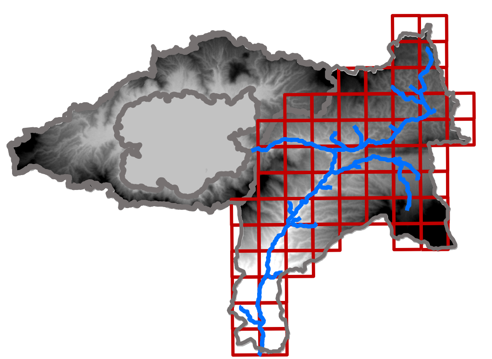
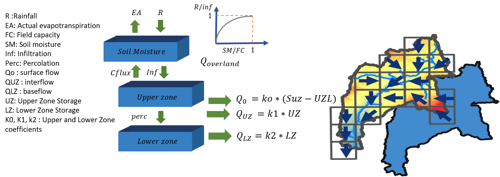

[](https://github.com/serapeum-org/Hapi/actions/workflows/tests.yml)
[](https://github.com/serapeum-org/Hapi/actions/workflows/lint.yml)
[](https://codecov.io/gh/serapeum-org/Hapi)
[](https://serapeum-org.github.io/Hapi)
[](https://github.com/pre-commit/pre-commit)
[](https://www.gnu.org/licenses/gpl-3.0)
[](https://doi.org/10.5281/zenodo.5758979)

[](https://pypi.org/project/HAPI-Nile/)
[](https://anaconda.org/conda-forge/hapi)
[](https://pypi.org/project/HAPI-Nile/)
[](https://anaconda.org/conda-forge/hapi)
[](https://pepy.tech/project/hapi-nile)
[](https://pepy.tech/project/hapi-nile)
[](https://anaconda.org/conda-forge/hapi)

[](https://github.com/serapeum-org/Hapi/commits/main)
[](https://github.com/serapeum-org/Hapi/stargazers)
[](https://github.com/serapeum-org/Hapi/network/members)

 


Hapi - Hydrological library for Python
=====================================================================
**Hapi** is an open-source Python Framework for building raster-based conceptual distributed hydrological models using HBV96 lumped
model & Muskingum routing method at a catchment scale (Farrag & Corzo, 2021), Hapi gives a high degree of flexibility to all components of the model
(spatial discretization - cell size, temporal resolution, parameterization approaches and calibration (Farrag et al., 2021)).


  

Hapi

Main Features
-------------
  - Modified version of HBV96 hydrological model (Bergström, 1992) with 15 parameters in case of considering
   snow processes, and 10 parameters without snow, in addition to 2 parameters of Muskingum routing method
  - Meteorological inputs for the hydrologic model simulation are downloaded with
    [earthlens](https://github.com/serapeum-org/earthlens) (CHIRPS rainfall, ERA5 temperature and
    evapotranspiration), which replaces the deprecated earth2observe package
  - GIS modules to enable the modeler to fully prepare the meteorological inputs and do all the preprocessing
    needed to build the model (align rasters with the DEM), in addition to various methods to manipulate and
    convert different forms of distributed data (rasters, NetCDF, shapefiles)
  - Sensitivity analysis module based on the concept of one-at-a-time OAT and analysis of the interaction among
    model parameters using the Sobol concept ((Rusli et al., 2015)) and a visualization
  - Statistical module containing interpolation methods for generating distributed data from gauge data, some
    distribution for frequency analysis and Maximum likelihood method for distribution parameter estimation.
  - Visualization module for animating the results of the distributed model, and the meteorological inputs
  - Optimization module, for calibrating the model based on the Harmony search method

Hapi integrates the global hydrological parameters obtained by Beck et al., (2016), to reduce model complexity
and uncertainty of parameters.

Future work
-------------
  - Developing a regionalization method for connection model parameters with some catchment characteristics for better model calibration.
  - Developing and integrate river routing method (kinematic and diffusive wave approximation)
  - Apply the model for large scale (regional/continental) cases
  - Developing a DEM processing module for generating the river network at different DEM spatial resolutions.

For using Hapi please cite Farrag et al. (2021) and Farrag & Corzo (2021)

IHE-Delft sessions
------------------
- In April 14-15 we had a two days session for Masters and PhD student in IHE-Delft to explain the different modules and the distributed hydrological model in Hapi [Day 1](https://youtu.be/HbmUdN9ehSo) ,  [Day 2](https://youtu.be/m7kHdOFQFIY)

References
-------------
Farrag, M. & Corzo, G. (2021) MAfarrag/Hapi: Hapi. doi:10.5281/ZENODO.4662170

Farrag, M., Perez, G. C. & Solomatine, D. (2021) Spatio-Temporal Hydrological Model Structure and Parametrization Analysis. J. Mar. Sci. Eng. 9(5), 467. doi:10.3390/jmse9050467 [Link](https://www.researchgate.net/publication/351143581_Spatio-Temporal_Hydrological_Model_Structure_and_Parametrization_Analysis)

Beck, H. E., Dijk, A. I. J. M. van, Ad de Roo, Diego G. Miralles, T. R. M. & Jaap Schellekens,  and L. A. B. (2016) Global-scale regionalization of hydrologic model parameters-Supporting materials 3599–3622. doi:10.1002/2015WR018247.Received

Bergström, S. (1992) The HBV model - its structure and applications. Smhi Rh 4(4), 35.

Rusli, S. R., Yudianto, D. & Liu, J. tao. (2015) Effects of temporal variability on HBV model calibration. Water Sci. Eng. 8(4), 291–300. Elsevier Ltd. doi:10.1016/j.wse.2015.12.002


Installing hapi
===============

## pip

To install the last release, use pip. The distribution is named `HAPI-Nile` and the import package is `hapi`.

```
pip install HAPI-Nile
```

## conda

Installing `hapi` from the `conda-forge` channel can be achieved by:

```
conda install -c conda-forge hapi
```

It is possible to list all of the versions of `hapi` available on your platform with:

```
conda search hapi --channel conda-forge
```

## Install from GitHub

To install the latest development version, install the library from GitHub:

```
pip install git+https://github.com/serapeum-org/Hapi
```

Quick start
===========

```
  >>> import hapi
```

[other code samples](https://serapeum-org.github.io/Hapi)

## Naming Convention
[PEP8](https://peps.python.org/pep-0008/#naming-conventions)
- module names: lower case word, preferably one word if not, separate words with underscores (module.py, my_module.py).
- class names: PascalCase (Model, MyClass).
- class method/function: snake_case (get_file, read_config). They should have a verb in them, because they perform some action.

The CamelCase entry points that survived from earlier releases (`Run.RunHapi`, `Wrapper.RRMModel` and the rest)
have been renamed to snake_case. There is no compatibility alias: the names above are the only ones.
