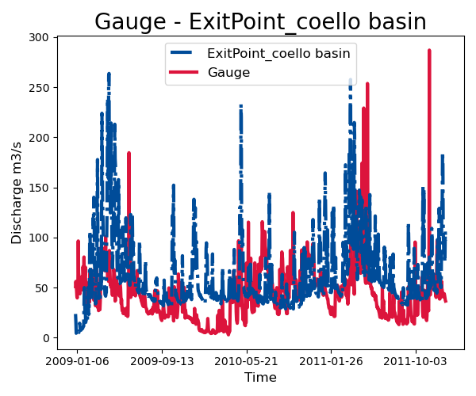
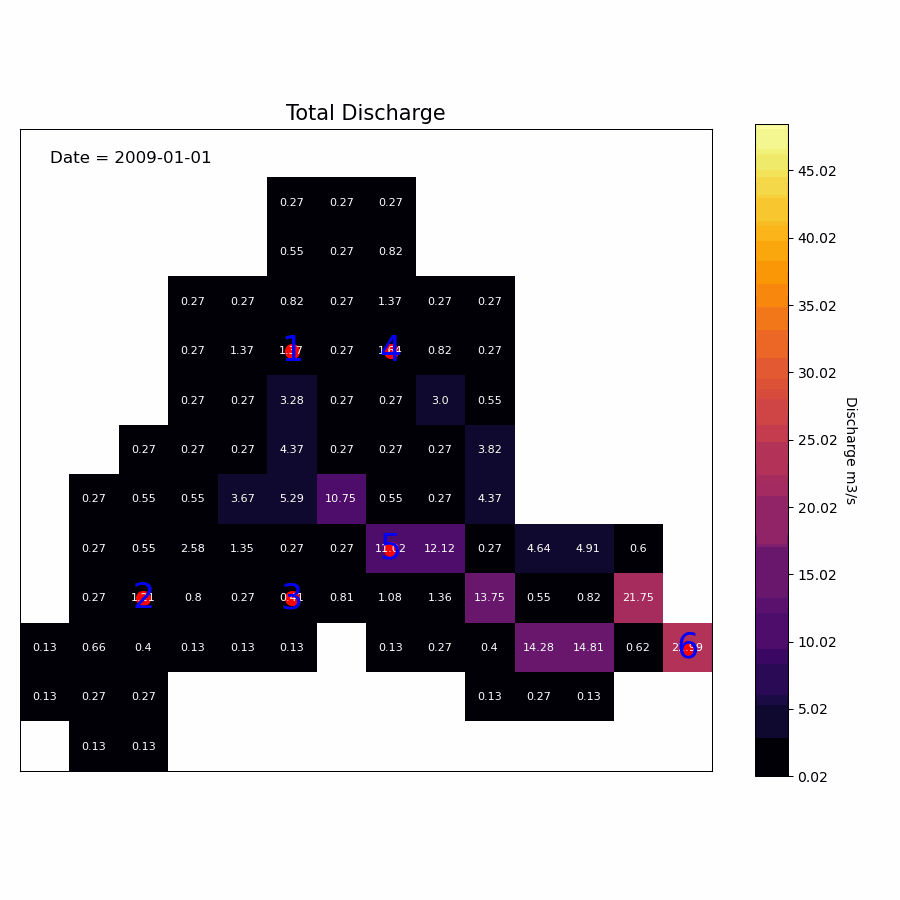

# Distributed Hydrological Model Calibration
The calibration of the Distributed rainfall runoff model follows the same steps of running the model with extra steps to define the calibration algorithm arguments

## 1- Catchment Object
- Import the Catchment object which is the main object in the distributed model, to read and check the input data,  and when the model finish the simulation it stores the results and do the visualization


```python

class Catchment:

    def __init__(self, name, StartDate, EndDate, fmt="%Y-%m-%d", SpatialResolution = 'Lumped',
                 TemporalResolution = "Daily"):
		"""
        =============================================================================
            Catchment(name, StartDate, EndDate, fmt="%Y-%m-%d", SpatialResolution = 'Lumped',
                             TemporalResolution = "Daily")
        =============================================================================
        Parameters
        ----------
        name : [str]
            Name of the Catchment.
        StartDate : [str]
            starting date.
        EndDate : [str]
            end date.
        fmt : [str], optional
            format of the given date. The default is "%Y-%m-%d".
        SpatialResolution : TYPE, optional
            Lumped or 'Distributed' . The default is 'Lumped'.
        TemporalResolution : TYPE, optional
            "Hourly" or "Daily". The default is "Daily".
	"""
```
- To instantiate the object you need to provide the `name`, `statedate`, `enddate`, and the `SpatialResolution`

```python
from hapi.catchment import Catchment
from hapi.inputs import FlowNetwork, MeteoInputs

start = "2009-01-01"
end = "2011-12-31"
name = "Coello"

Coello = Catchment(name, start, end, SpatialResolution = "Distributed")
```

# Read Meteorological Inputs


- First define the directory where the data exist

```python
Path = Comp + "/data/distributed/coello"
PrecPath = Path + "/prec"
Evap_Path = Path + "/evap"
TempPath = Path + "/temp"
FlowAccPath = Path + "/GIS/acc4000.tif"
FlowDPath = Path + "/GIS/fd4000.tif"
ParPathRun = Path + "/Parameter set-Avg/"
```
- Then use the each method in the object to read the coresponding data

```python
Coello.meteo = MeteoInputs.from_rasters(PrecPath, TempPath, Evap_Path)
Coello.flow_network = FlowNetwork.from_rasters(FlowAccPath, FlowDPath)
```
- To read the parameters you need to provide whether you need to consider the snow subroutine or not

```python
Snow = 0
Coello.read_parameters(ParPathRun, Snow)
```

## 2- Lumped Model

- Get the Lumpde conceptual model you want to couple it with the distributed routing module which in our case HBV
	and define the initial condition, and catchment area.

```python
from hapi.rrm.hbv_bergestrom92 import HBVBergestrom92 as HBV

CatchmentArea = 1530
InitialCond = [0,5,5,5,0]
Coello.read_lumped_model(HBV, CatchmentArea, InitialCond)
```
- If the Inpus are consistent in dimensions you will get a the following message


- to check the performance of the model we need to read the gauge hydrographs

```python
Coello.read_gauge_table("Hapi/Data/00inputs/Discharge/stations/gauges.csv", FlowAccPath)
GaugesPath = "Hapi/Data/00inputs/Discharge/stations/"
Coello.read_discharge_gauges(GaugesPath, column='id', fmt="%Y-%m-%d")
```
## 3-Run Object


- The `Run` object connects all the components of the simulation together, the `Catchment` object, the `Lake` object and the `distributedrouting` object
- import the Run object and use the `Catchment` object as a parameter to the `Run` object, then call the run_distributed method to start the simulation

```python
from hapi.run import Run
Run.run_distributed(Coello)
```
- the result of the simulation will be stored as attributes in the Catchment object as follow

```python
"""
Outputs:
    1-statevariables: [numpy attribute]
        4D array (rows,cols,time,states) states are [sp,wc,sm,uz,lv]
    2-qlz: [numpy attribute]
        3D array of the lower zone discharge
    3-quz: [numpy attribute]
        3D array of the upper zone discharge
    4-qout: [numpy attribute]
        1D timeseries of discharge at the outlet of the catchment
        of unit m3/sec
    5-quz_routed: [numpy attribute]
        3D array of the upper zone discharge  accumulated and
        routed at each time step
    6-qlz_translated: [numpy attribute]
        3D array of the lower zone discharge translated at each time step
"""
```
## 4-Extract Hydrographs

- The final step is to extract the simulated Hydrograph from the cells at the location of the gauges to compare
- The `extract_discharge` method extracts the hydrographs, however you have to provide in the gauge file the coordinates of the gauges with the same coordinate system of the `FlowAcc` raster

```python
Coello.extract_discharge(factor=Coello.GaugesTable['area ratio'].tolist())

for i in range(len(Coello.GaugesTable)):
	gaugeid = Coello.GaugesTable.loc[i,'id']
	print("----------------------------------")
	print("Gauge - " +str(gaugeid))
	print("RMSE= " + str(round(Coello.metrics.loc['RMSE',gaugeid],2)))
	print("NSE= " + str(round(Coello.metrics.loc['NSE',gaugeid],2)))
	print("NSEhf= " + str(round(Coello.metrics.loc['NSEhf',gaugeid],2)))
	print("KGE= " + str(round(Coello.metrics.loc['KGE',gaugeid],2)))
	print("WB= " + str(round(Coello.metrics.loc['WB',gaugeid],2)))
	print("Pearson CC= " + str(round(Coello.metrics.loc['Pearson-CC',gaugeid],2)))
	print("R2 = " + str(round(Coello.metrics.loc['R2',gaugeid],2)))
```
- The `extract_discharge` will print the performance metics


## 5-Visualization

- Firts type of visualization we can do with the results is to compare the gauge hydrograph with the simulatied hydrographs
- Call the `plot_hydrograph` method and provide the period you want to visualize with the order of the gauge

```python
gaugei = 5
plotstart = "2009-01-01"
plotend = "2011-12-31"

Coello.plot_hydrograph(plotstart, plotend, gaugei)
```



## 6-Animation

- The best way to visualize a time series of distributed data is an animation. The `Catchment` object
  has a `plot_distributed_results` method which animates any of the model results.

The keyword arguments are forwarded to
`cleopatra.glyphs.gridded.array_glyph.ArrayGlyph.animate`; see its documentation for the full list.
The plain ones are `figsize`, `interval`, `cmap`, `vmin`/`vmax`, `title` and `ticks_spacing`.
cleopatra 0.30 moved the styling keywords onto typed group objects, so the colour scale is
`color=ColorScaling.linear()` (also `.power(gamma=...)`, `.sym_log(...)`, `.midpoint(at=...)`,
`.boundary(bounds=...)`), the cell-value labels are
`cells=CellValues(show=True, size=..., background_threshold=...)`, and the frame time-stamp is
`frame_label=FrameLabel(location=[...], color=...)`. The gauge markers are built by Hapi itself
when `gauges=True`.

`option` selects the variable to animate:

| option | variable | option | variable |
| --- | --- | --- | --- |
| 1 | Total discharge | 7 | Lower zone |
| 2 | Upper zone discharge | 8 | Water content |
| 3 | Ground water | 9 | Precipitation |
| 4 | Snow pack | 10 | Evapotranspiration |
| 5 | Soil moisture | 11 | Temperature |
| 6 | Upper zone | | |

```python
from cleopatra.glyphs.gridded.array_glyph import FrameLabel
from cleopatra.styling.params import CellValues
from cleopatra.styling.scaling import ColorScaling

plotstart = "2009-01-01"
plotend = "2009-04-20"

anim = Coello.plot_distributed_results(
    plotstart,
    plotend,
    option=1,
    gauges=True,
    figsize=(9, 9),
    ticks_spacing=5,
    interval=200,
    cmap="inferno",
    color=ColorScaling.linear(),
    cells=CellValues(show=True),
    frame_label=FrameLabel(location=[0.1, 0.2]),
)
```



- To save the animation, the output format is taken from the file extension. GIF is written with
  Pillow; `mov`, `avi` and `mp4` need [FFmpeg](https://ffmpeg.org/) installed and available on your
  system.

```python
Coello.save_animation("results/anim.gif", fps=2)
```
## 7-Save the result into rasters

- To save the results as rasters provide the period and the path

```python
start = "2009-01-01"
end = "2010-04-20"
prefix = "Qtot_"

Coello.save_results(
    FlowAccPath,
    result=1,
    start=start,
    end=end,
    path="results/",
    prefix=prefix,
)
```
