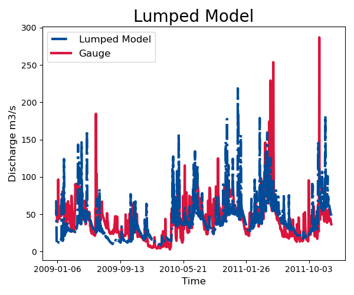

# Lumped Model Run

!!! tip "Or drive it from a YAML file"

    Everything this page assembles in Python can live in a run configuration instead --
    one file holding the paths, dates and settings, read by `Catchment.from_yaml`. See
    [Run configuration](run-configuration.md).

To run the HBV lumped model inside Hapi you need to prepare the meteorological inputs (rainfall, temperature and potential evapotranspiration), HBV parameters, and the HBV model (you can load Bergström, 1992 version of HBV from Hapi )

- First load the prepared lumped version of the HBV module inside Hapi, the triangular routing function and the wrapper function that runs the lumped model `RUN`.

```python
import hapi.rrm.hbv_bergestrom92 as HBVLumped
from hapi.run import Run
from hapi.catchment import Catchment
from hapi.routing import Routing
```
- read the meteorological data, data has be in the form of numpy array with the following order [rainfall, ET, Temp, Tm], ET is the potential evapotranspiration, Temp is the temperature (C), and Tm is the long term monthly average temperature.

```python
Parameterpath = Comp + "/data/lumped/Coello_Lumped2021-03-08_muskingum.txt"
MeteoDataPath = Comp + "/data/lumped/meteo_data-MSWEP.csv"

### meteorological data
start = "2009-01-01"
end = "2011-12-31"
name = "Coello"
Coello = Catchment(name, start, end)
Coello.read_lumped_inputs(MeteoDataPath)
```
- Meteorological data

```python
start = "2009-01-01"
end = "2011-12-31"
name = "Coello"
Coello = Catchment(name, start, end)
Coello.read_lumped_inputs(MeteoDataPath)
```
- Lumped model
prepare the initial conditions, cathcment area and the lumped model.

```python
# catchment area
AreaCoeff = 1530
# [Snow pack, Soil moisture, Upper zone, Lower Zone, Water content]
InitialCond = [0,10,10,10,0]

Coello.read_lumped_model(HBVLumped, AreaCoeff, InitialCond)
```
- Load the pre-estimated parameters
    snow option (if you want to simulate snow accumulation and snow melt or not)

```python
Snow = 0 # no snow subroutine
# if routing using Maxbas True, if Muskingum False
Coello.read_parameters(Parameterpath, Snow)
```
- Prepare the routing options.

```python
# RoutingFn = Routing.triangular_routing_2
RoutingFn = Routing.muskingum_v
Route = 1
```
- now all the data required for the model are prepared in the right form, now you can call the `run_lumped` wrapper to initiate the calculation

```python
Run.run_lumped(Coello, Route, RoutingFn)
```
to calculate some metrics for the quality assessment of the calculate discharge the `statista.descriptors` contains some
metrics like `rmse`, `nse`, `kge` and `wb` , you need to load it, a measured time series of doscharge for the same
period of the simulation is also needed for the comparison.

all methods in `statista.descriptors` takes two numpy arrays of the same length and return real number.

```python
import statista.descriptors as metrics

Metrics = dict()
Qobs = Coello.QGauges['q']

Metrics['RMSE'] = metrics.rmse(Qobs, Coello.Qsim['q'])
Metrics['NSE'] = metrics.nse(Qobs, Coello.Qsim['q'])
Metrics['NSEhf'] = metrics.nse_hf(Qobs, Coello.Qsim['q'])
Metrics['KGE'] = metrics.kge(Qobs, Coello.Qsim['q'])
Metrics['WB'] = metrics.wb(Qobs, Coello.Qsim['q'])

print("RMSE= " + str(round(Metrics['RMSE'],2)))
print("NSE= " + str(round(Metrics['NSE'],2)))
print("NSEhf= " + str(round(Metrics['NSEhf'],2)))
print("KGE= " + str(round(Metrics['KGE'],2)))
print("WB= " + str(round(Metrics['WB'],2)))
```
To plot the calculated and measured discharge import matplotlib

```python
gaugei = 0
plotstart = "2009-01-01"
plotend = "2011-12-31"
Coello.plot_hydrograph(plotstart, plotend, gaugei, Title= "Lumped Model")
```


- To save the results

```python
start = "2009-01-01"
end = "2010-04-20"

Path = SaveTo + "Results-Lumped-Model" + str(dt.datetime.now())[0:10] + ".txt"
Coello.save_results(result=5, start=start, end=end, path=Path)
```
